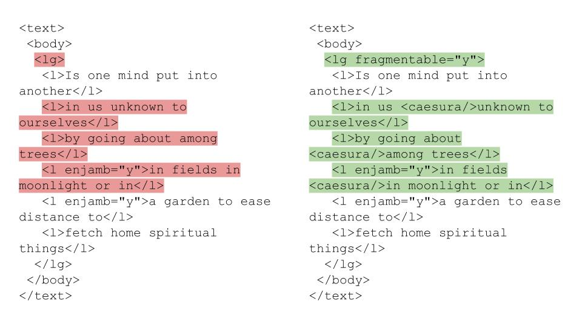

# Encoding as Close Reading: A Prototype for Submitting and Comparing Encoded Poetry

## Contents

- [Abstract](#abstract)
- [Humanistic Importance](#humanistic-importance)
- [Deliverables](#deliverables)
- [Timeline](#timeline)
- [Resources](#resources)
- [Appendix: Use Cases](#appendix-use-cases)
- [Works Cited](#works-cited)

## Abstract

Encoding documents, in various markup languages, shares many similarities with the close reading of literary texts. Just as close readers interpret literary texts by attending to the formal elements that comprise them, encoders structure documents by devising schemas and semantic values that best describe them.

This project will devise a platform and deliver a prototype where users can upload poetry, as plain text, and then encode it, and invite others to encode it, using TEI XML. The plain text poetry will act as the parent content object, and its encodings will be the child content objects. Users will be able to submit their own encodings via a form, which will, ideally, also validate the XML. They will also be able compare any two encodings through a well-designed visual display.

This technology might help teachers of either poetry and poetics or the digital humanities. Indeed, it could supplement in-class discussions on the practice of close reading or the mechanics of encoding; it could also help teachers solicit and review encoding assignments. Though textual scholars might also be interested in such a prototype—e.g. for building small-scale digital editions with various transcriptions or markup—this project will focus more on pedagogy than on scholarship. Given that encoding remains a fundamental aspect of computing, and close reading a fundamental tactic for interpreting poetry, such technology should remain relevant for the foreseeable future.

My academic interests and professional background make me a good candidate to lead such a project. At the CUNY Grad Center, I’ve taken courses in the English PhD program, and my work has used close readings of experimental modernist writers like Henry Green and Wallace Stevens to explore literary form and representations of the body. Meanwhile, my professional experience in publishing and web development has made me familiar with encoding schemas and core front-end technologies. At the Modern Language Association, I serve as the head of online production and oversee the content management and web development of [mla.org](https://mla.org), [*The MLA Style Center*](https://style.mla.org), the [*Literary Research Guide*](https://lrg.mla.org), and numerous other digital properties and products. I’m adept at building consensus among various stakeholders and team members to deliver projects on time and budget.

## Humanistic Importance

If text encoding constitutes a fundamental, but basic, task in computing, then close reading constitutes a similarly fundamental, but basic, task in literary criticism. For many developers, wrangling HTML or XML tags remains a mundane part of their work—important, certainly, but not as energizing as writing, for example, applications in Python, Ruby, or a host of other programming languages. Meanwhile, close reading encourages literary critics to demonstrate how the formal elements of a literary text articulate meaning. Since the emergence of close reading, in the post-war period dominated by the New Criticism, however, literary critics have increasingly emphasized the importance of contextual, rather than formal, readings of texts. While close reading operates as an indispensable tool, it serves as the basis for contextual interpretations of literary texts in contemporary scholarship.

How should the digital humanities, then, approach encoding and close reading? Should they continue to assign both basic roles in their respective spheres? Or should the digital humanities establish new connections between encoding and close reading and, in doing so, re-envision their roles in contemporary literary studies? The second approach seems more worthwhile and, as Kate Singer has argued in the *Journal of Interactive Technology and Pedagogy*, “the practice of encoding effectively engages the encoder in a determinative act of reading” (Singer). Encoding, in other words, generates a (close) reading of the text at hand. Susan Schreibman makes a similar argument: “Text encoding ... is not theory-free. It is subjective, theoretical, and interpretative. Texts, particularly literary texts, have competing hierarchies, all of which may have equal claim to being represented as they express different views of the text” (Schreibman). “Subjective,” “theoretical,” “interpretive,” and “competing hierarchies” that “express different views of the text”—the vocabulary here could describe close reading. If encoding prompts “determinative” reading, and if encoding itself is never “theory-free,” then we can regard it increasingly as a humanistic act. Devising a platform, and building a prototype of it, can encourage others to see these connections and incorporate them into their pedagogy (or even scholarship).

Of course, individuals could encode any literary text or document with such a prototype. Poetry, however, offers a good point of departure for considering the relationship between encoding and close reading. Studying poetry forces readers to contend with formal techniques related to hierarchies (e.g. section, stanza, line) and semantic values (e.g. alliteration, enjambment, simile) that encoding might capture well. As Chuck Rybak writes in *Digital Pedagogy in the Humanities*, “Poetry is a formal enterprise, and those forms have been evolving for centuries. We have new forms before us. We need new pedagogies to match” (Rybak). This project aims to aid new pedagogies for the study of “the formal enterprise” of poetry. In encoding, it finds a digital practice akin to the close reading that has, for some time, been the means for understanding the forms, and the evolution of those forms, that comprise poetry.

## Deliverables

### Prototype

Most importantly, this project will deliver a prototype of a platform where users can upload poetry, encode it, and invite others to do the same. They will accomplish this through a form that first accepts a plain text version of the poetry to be encoded. This form will require basic metadata (e.g. author, title, name of submitter) and create a parent object. With the parent object created, users will then submit their encodings of the poetry through a subsequent form that allows them to add TEI tags, validates their XML, and requires basic metadata (e.g. name of submitter). Each encoding will become a child object of the parent object. Users will also be able to compare the differences between any two child objects through a front-end display. See **Fig. 1** for an example of how this might look.

**Fig 1.** Comparison of two different encodings, which use tags from the [TEI “Verse” module](http://www.tei-c.org/release/doc/tei-p5-doc/en/html/VE.html), of a selection from Susan Howe’s *That This*.

Building this prototype will require numerous back-end and front-end deliverables, which I’ve itemized below. Given the short timeframe allotted to deliver it, the project focus on the features mentioned above. While TEI initiatives like [TAPAS Project](https://jtei.revues.org/788) aim to provide “publishing and repository services,” we’ll aim to deliver a discrete pedagogical tool (TAPAS).

For those interested in further details of how this pedagogical tool might help teachers, please refer to [appendix of use cases](#appendix-use-cases) below.

#### Back-End

- Framework or CMS in which to build the prototype.
- Database and data model for storing submissions.
- Code for upload and encoding forms.
- Code for XML validation of encoding submissions.
- Code for front-end comparison display.
- Solution for hosting the prototype.
- GitHub repository for all project code.

#### Front-End

- Information architecture brief, explaining the intended structure of the prototype.
- Wireframes for homepage, upload and encoding forms, parent/child object displays, and comparison display.
- Design brief, explaining the intended look and feel of the prototype.
- HTML template.
- CSS.

### Documentation

This project will include documentation both for users and for developers. User documentation will be available on the prototype via a Help page; developer documentation will be available in the GitHub repository.

### Scholarly Outreach Campaign

In order both to publicize the prototype and ensure that it aligns with the needs of teachers and textual scholars, this project will also have a scholarly outreach campaign. This campaign will consist of:

- Campaign overview document.
- Twitter account.
- Project blog.
- Beta testing with potential users.

The outreach campaign should also develop a decent, compelling name for this project. “Encoding as Close Reading” is clunky, and I’d like to avoid names that employ silly conventions used by startups—e.g. *Encode.ly* or *Encodia*.

### Course-Specific Deliverables

- A 15–20 page group paper.
- A public presentation of the prototype at the end of the semester.

## Timeline

### Prototype

Note that this timeline presents earlier, more back-end- and front-end-specific deliverables deadlines below.

**5 April:** Initial prototype for group review.

**12 April:** Revised prototype incorporating group feedback.

**19 April:** UX/UI testing with potential users.

**26 April:** Revised prototype incorporating UX/UI testing feedback.

**3 May:** More testing, debugging, and review.

**10 May:** Final prototype and rehearsal for public-launch presentation.

**17 May:** Public launch.

**24 May:** Submit final version, incorporating any potential feedback from public launch.

#### Back-End

**1 March:** List of potential frameworks or CMSs to use, with benefits and drawbacks for each explained. GitHub repository created.

**8 March:** Decision made on which framework or CMS to use. Database and data model options provided.

**15 March:** Decision made on database and data model. List of potential solutions for forms, XML validation, front-end diff display, and hosting, with benefits and drawbacks for each explained.

**22 March:** Decisions made on which solutions to use. 

**29 March:** Begin building out framework or CMS and integrating solutions.

#### Front-End

**1 March:** Information architecture brief.

**8 March:** Wireframes.

**15 March:** Design brief and mockups of wireframes.

**22 March:** Begin work on HTML template and CSS.

### Documentation

**5 April:** Begin organizing developer documentation via an automated tool (e.g. [phpDocumentor](https://www.phpdoc.org/)) that gathers all comments from code.

**12 April:** Review automated developer documentation and determine its usefulness. Compile list of topics that might interest potential users.

**19 April:** Begin editing developer documentation. Begin organizing user documentation.

**26 April:** Continue working on both developer and user documentation; note questions, comments, and points of confusion from UI/UX testing.

**3 May:** Complete first drafts of both developer and user documentation.

**10 May:** Continue working on developer documentation; upload user documentation to prototype.

**17 May:** Final drafts of both developer and user documentation.

**24 May:** Incorporate any necessary changes to either developer or user documentation based on public presentation.

### Scholarly Outreach Campaign

**1 March:** Draft outreach campaign plan.

**8 March:** Review and revise plan. Create Twitter account and project blog (consider using *Commons* or GitHub pages to host).

**15 March:** Weekly Twitter updates, blog post. Begin identifying and approaching potential users.

**22 March:** Weekly Twitter updates, blog post.

**29 March:** Weekly Twitter updates, blog post. Compile list of potential users interested in UI/UX testing.

**5 April:** Weekly Twitter updates, blog post.

**12 April:** Weekly Twitter updates, blog post.

**19 April:** Weekly Twitter updates, blog post. Arrange and host UI/UX testing.

**26 April:** Weekly Twitter updates, blog post.

**3 May:** Weekly Twitter updates, blog post. Lead preparation for public presentation.

**10 May:** Weekly Twitter updates, blog post. Lead rehearsal for public presentation.

**17 May:** Weekly Twitter updates, blog post.

**24 May:** Weekly Twitter updates, blog post.

### Course-Specific Deliverables

**5 April:** Team members compile outline and determine responsibilities for final paper.

**12 April:** Begin work on final paper.

**19 April:** Continue work on final paper.

**26 April:** First draft of final paper.

**3 May:** Edit final paper. Team members compile outline and determine responsibilities for public presentation.

**10 May:** Continue editing final paper. Rehearse public presentation.

**17 May:** Second draft of final paper. Give public presentation.

**24 May:** Complete and submit final paper.

## Roles

A **project manager** will ensure that the project team completes all deliverables on time and on budget. He or she will be responsible for compiling weekly status reports and communicating, frequently, with all team members to gauge progress. 

A **developer** will manage all of the back-end and front-end deliverables listed above and will provide guidance on all key technology decisions throughout the lifecycle of the project.

This project will also feature an **information architect** and/or **front-end developer** who will work closely with the developer to build out the prototype.

A **designer** may also be helpful to create a compelling look and feel for the prototype. 

Finally, a **community manager** will manage the scholarly outreach campaign above.

## Resources

Despite listing five potential roles, this project may only require 3–5 individuals. While the developer role will certainly require one individual, the remaining four roles may be combined in a variety of ways. For example, this project may combine the information architect and/or front-end developer role with the designer role or the project manager role with the community manager role. (N.B. The developer role will be the most challenging, I believe, considering the back-end deliverables listed above.)

Depending on software solution decisions, this project may also require a hosting budget. Hopefully, it will not require a software procurement budget. In fact, as a digital humanities project, it will aim to use free open-source software as much as possible.

## Appendix: Use Cases

### English or Comparative Literature Professor

Professor Peter Poetics teaches a 200-level class on the study of poetry at a small liberal arts college. He’s interested in multimodal pedagogy but hasn’t come across a decent technique or technology to teach basic poetics digitally. Though he thinks that TEI encoding might help his students understand the hierarchies and techniques at work in many of the works on the syllabus, he feels that existing technologies would be too confusing for non-specialist undergraduates. What he needs is a platform that simplifies encoding through discrete tasks.  

### Digital Humanities Professor

Professor Debbie DH teaches “Digital Humanities 101” at a large state university. Her class provides a multidisciplinary survey of the field, and she tries to incorporate as many praxis-oriented activities as possible into the syllabus. During her week on digital editions and the emergence of the digital humanities in English departments, she wants her students to attempt their own encodings of some documents. Her students have solid computing skills or are acquiring them—they would have no issues using software like Oxygen to complete their encoding assignments. Debbie DH wants an easy way to display these encodings in class, however, in order to chart the subtle changes across submissions. She needs a platform that can archive multiple encodings and display the differences among them through a compelling design.

## Works Cited

“About.” *TAPAS Project.* [http://www.tapasproject.org/about](http://www.tapasproject.org/about).

Howe, Susan. *That This*. New Directions, 2010.

Rybak, Chuck. “Poetry.” *Digital Pedagogy in the Humanities: Concepts, Models, and Experiments*, edited by Rebecca Frost Davis, Matthew K. Gold, Katherine D. Harris, and Jentery Sayers, Modern Language Association, 2016, [https://digitalpedagogy.mla.hcommons.org/keywords/poetry/](https://digitalpedagogy.mla.hcommons.org/keywords/poetry/).

Schreibman, Susan. “Digital Scholarly Editing.” *Literary Studies in the Digital Age*, edited by Kenneth M. Price and Ray Siemens, Modern Language Association, 2013, [https://dlsanthology.mla.hcommons.org/digital-scholarly-editing/](https://dlsanthology.mla.hcommons.org/digital-scholarly-editing/).

Singer, Kate. “Digital Close Reading: TEI for Teaching Poetic Vocabularies.” *The Journal of Interactive Technology and Pedagogy*, no. 3, 15 May 2013, [https://jitp.commons.gc.cuny.edu/digital-close-reading-tei-for-teaching-poetic-vocabularies/](https://jitp.commons.gc.cuny.edu/digital-close-reading-tei-for-teaching-poetic-vocabularies/).

“Verse.” *P5: Guidelines for Electronic Text Encoding and Interchange*, version 3.1.0, 15 December 2016, [http://www.tei-c.org/release/doc/tei-p5-doc/en/html/VE.html](http://www.tei-c.org/release/doc/tei-p5-doc/en/html/VE.html). *Text Encoding Initiative*, [http://www.tei-c.org](http://www.tei-c.org).
